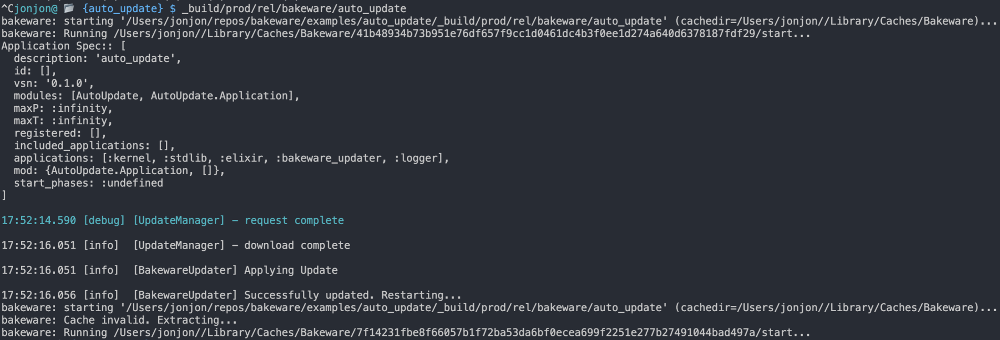

# Bakeware Updater

Check for executable updates via SousChef API




## Usage

```elixir
iex()> BakewareUpdater.check("hello_world", "1.2.3")
"ok"

iex()> BakewareUpdater.check("hello_world", "1.2.4")
%{"status" => "update", "url" => "https://some-download.url"}
```
